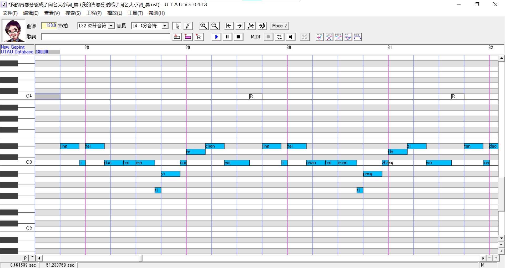
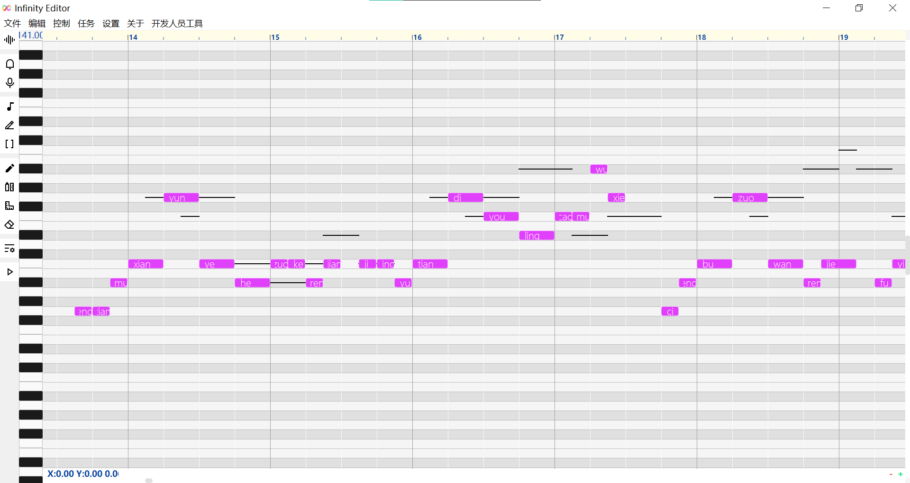
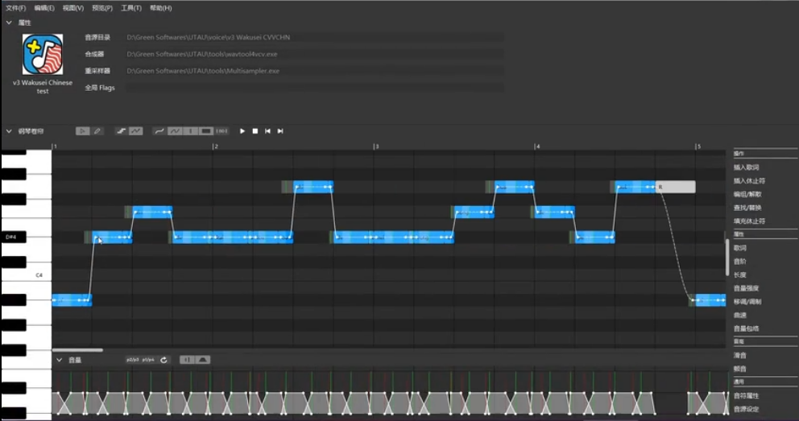
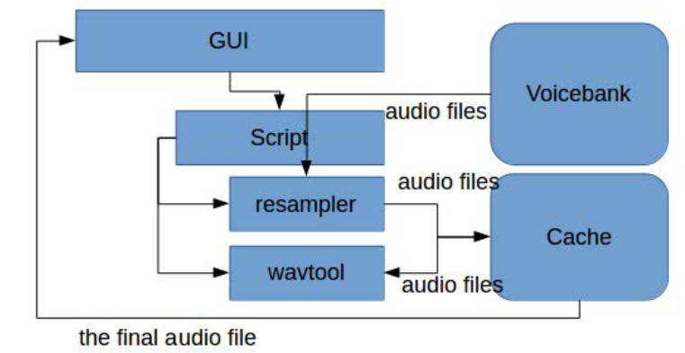

# 从工程角度评价UTAU，并对新时代的UTAU提出设想

[评论区](https://github.com/oxygen-dioxide/singblog/issues/1)
## 背景
UTAU作为歌声合成技术的实验室，拥有丰富的引擎、插件和音源生态。多种音源架构（整音、CVVC、VCV），多种合成算法（psola、world、llsm）都在UTAU上实现。Vocaloid和SynthV等商业软件也从UTAU中吸收了很多设计思路。UTAU大大推动了歌声合成技术的发展。

但是最近，新的歌声合成编辑器如雨后春笋般出现

[Infinity](https://www.bilibili.com/video/av541600953)

[QPitchEditor](https://www.bilibili.com/video/av714520647)

这是因为，UTAU逐渐无法满足目前后端引擎，尤其是AI引擎的需求。歌声合成圈子正等待着一款“新时代的UTAU”的出现。本文将从工程化的角度总结UTAU的优缺点，并为“新时代的UTAU”提供设计思路。

## UTAU的工作原理
这一部分是介绍UTAU的api。即UTAU调用引擎和插件的方式。这也是决定UTAU能成功走到现在，以及未来可能限制UTAU发展的主要因素。

### 引擎接口

1. 用户点击播放后，UTAU生成一个临时的bat脚本
2. 脚本调用resampler（即引擎），传入当前音符的原音设定、长度、音高曲线、flag等信息。resampler从音源中取出对应音频，变调后存放在临时文件夹
    在这里，音符信息是通过命令行参数传入UTAU引擎的。
3. 脚本调用wavtool，传入原音设定、音量包络等信息。wavtool将resampler合成的音频拼接到输出音频末尾
4. 对每个音符重复2、3步骤，直到音轨结尾
5. UTAU播放输出的音频

### 插件接口
UTAU的插件接口更简单。UTAU先写入一个临时ust文件，然后用插件打开该ust文件并修改，最后UTAU读入修改后的文件。

## UTAU的优点
### 1.前后端分离
在UTAU中，后端引擎与前端编辑器是分离的。开发者不需要会写界面，只需要会写算法，就可以在UTAU上把自己的想法变成现实。这促成了UTAU生态的繁荣。

### 2.拥有包管理机制
UTAU支持uar格式的音源与插件包，拖入UTAU窗口自动安装。

### 3.简单的文本接口
UTAU通过命令行调用引擎和插件，所有数据均以文本形式传输，而不涉及到任何二进制接口。所以，可以用任何编程语言开发引擎和插件，甚至网页都可以（例如“朗读君”）。插件开发者无需深入理解UTAU的内部架构，即可编写插件。

## UTAU的缺点
### 1.开发框架老旧
UTAU使用的开发框架是已经停止支持的visual basic 6（vb6），将不会得到功能更新与安全更新。这也导致UTAU的乱码问题难以解决。

### 2.依赖平台特性
UTAU依赖windows的bat来合成，使UTAU难以迁移到mac和linux等其他平台。（UTAU有Mac版，但是不支持插件和第三方引擎）

### 3.引擎接口限制严重，可扩展性差
UTAU的引擎接口要求各音符的合成相互独立，合成器在合成当前音符时不知道前后其他音符的信息。在那个以变调拼接合成为主的时代，这种设计简化了引擎的开发。但是，AI合成一般是整句训练合成，至少要将以休止符分割的完整的乐句作为合成单位。

我们来看看moresampler的工作原理。与其他UTAU引擎不同，moresampler将原始音频编译为llsm中间文件（存储了谐波和噪波的频谱）。合成时，对频谱进行变调。在合成结束时拼接频谱，最后转换为音频。这套机制要求moresampler在音轨末尾进行后处理。这是UTAU接口原生不支持的。

那么moresampler是怎么实现的呢？moresampler会读入bat脚本，以判断当前是不是最后一个音符。这种解决方案依赖于bat脚本，可能UTAU更新一个版本（改变bat的格式，或者改用system函数直接调用引擎），或者采用第三方前端编辑器，或者移植到其他操作系统，就不能用了。

此外，UTAU在开发时只考虑了日文合成，所以只有前固定段而没有后固定段。在合成中文时会遇到短音切除尾音，长音拉长尾音的问题，必须进行拆音等workaround才能正常合成。

### 4.接口没有一套标准
UTAU虽然实现了前后端分离，但是没有一套明确的标准。

还是以moresampler为例。UTAU并没有明确定义“只要调用了引擎，传入参数就符合标准”，还是“必须生成一定格式的bat脚本来调用引擎才符合标准”。moresampler依赖了这一套机制，第三方前端编辑器的作者就必须使用同样的bat脚本才能兼容moresampler，这就为开放的UTAU生态带来了限制。

C# .net framework也不开源，但是提供了[C#语言规范](https://www.ecma-international.org/wp-content/uploads/ECMA-334_2nd_edition_december_2002.pdf)，就有了mono等第三方实现，将C#带到Mac和Linux等平台。

### 5.有很多奇怪的机制
例如，UTAU编辑器和引擎支持辅音速度取任意数值，但超过[0,200]区间的辅音速度不会保存，插件生成的超过该范围的辅音速度不会生效。

类似的机制还有很多，而且部分引擎和插件依赖这些机制。

这也就是目前的UTAU第三方编辑器（openutau、utsu）难以推广的原因。第三方编辑器需要兼容各种奇怪机制，同时支持引擎和插件接口，带着厚重的历史包袱，工程量很大。如果无法完全实现这些功能，又没有显著的创新，还不如用原版UTAU编辑器。

而deepvocal则不基于UTAU机制，而是另起炉灶，自己重新实现了一套音素机制和后端引擎来兼容现有的UTAU CVVC音源。这套机制简化了CVVC音源的开发与使用，所以比UTAU第三方编辑器获得了更多的用户。（但是deepvocal没有开放接口，也就没有成为UTAU的接班人）

当然，以上缺点大多是时代局限性造成的，不要苛责UTAU。UTAU从2008年就开始开发，当时vb6还是主流的开发框架之一。放在那个时候，UTAU开发者的选择是合理的，只是现在vb6已经过时。当时的计算机性能只允许拼接合成，接口也就是按照拼接合成来设计的。

## 新时代的UTAU的理想形态
既然现有的UTAU无法满足后端引擎的需求，那么一款怎样的产品能接过UTAU的重担，成为新的“歌声合成实验室”呢？
1. 开源
2. 前后端分离
3. 使用持续更新的开发框架，如qt、winui3等
4. 不依赖平台特性，为跨平台预留可能性
5. 至少兼容一部分UTAU音源（类似deepvocal兼容UTAU CVVC音源）
6. 前端编辑器不依赖UTAU及拼接合成机制。可以把整个音轨数据一次性传入引擎接口，用中间件来适配各种引擎（例如，适配传统拼接引擎的中间件像UTAU一样逐个音符调用wavtool和resampler，在中间件上处理扩张整音、CVVC、VCV等方案的拆音（presamp）。适配AI引擎的中间件把音轨切分为乐句，调用本地AI引擎或发送到服务器在线合成）。
    
    也就是说，这个前端编辑器在开发的时候，不要把自己仅仅定位为一款“更好的UTAU”，而是面向现代合成引擎的全新编辑器。
7. 使用包管理器管理音源、引擎和插件，提供统一的打包格式，提供命令行接口和GUI界面。如有可能，支持在线安装（类似pip install）

罗马不是一天建成的，这个“新时代的UTAU”也将是由开源社区的开发者添砖加瓦，逐步实现的。

## 附表：现有的开放式/开源歌声合成前端框架列表
收录标准：(1) 开源的gui歌声合成框架 或 (2)拥有开放接口的歌声合成框架
|框架|主要开发者|编程语言/框架|状态|开源|兼容utau|支持其他api|
|-|-|-|-|-|-|-|
|[UTAU](http://utau2008.xrea.jp/)|Ameya Ayame|Visual Basic|正式版，停更||√||
|[OpenUTAU](https://github.com/stakira/OpenUtau)|[stakira](https://github.com/stakira)|C# .net WPF|预览版|√|√||
|[UTSU](https://github.com/titinko/utsu)|[titinko](https://github.com/titinko)|Java|正式版，活跃开发|√|√|[NNSVS:讨论](https://github.com/titinko/utsu/issues/69)|
|[QSynthesis](https://www.bilibili.com/video/av714520647)|[至精至简](https://space.bilibili.com/87172593)|C++ Qt|内测||√||
|[Infinity](https://space.bilibili.com/1579918535)|[Wuchang](https://github.com/FangCunWuChang)|C++ Qt lua|开发中|√|计划|√|
|[Vogen](https://github.com/aqtq314/Vogen.Client)|[Doaz](https://github.com/aqtq314)|F# .net WPF|预览版|√|||
|[Muon](https://github.com/SwadicalRag/muon)|[SwadicalRag](https://github.com/SwadicalRag)|Dart Flutter|预览版，停更|√||Neutrino|

[评论区](https://github.com/oxygen-dioxide/singblog/issues/1)
